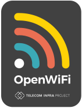

<p align="center">
    
</p>

# uCentralFMS

## What is this?
The uCentralFMS is a micro-service part of the OpenWiFi ecosystem. uCentralFMS is a Firmware Management Service
to facilitate the task of upgrade and maintaining the proper firmware for all the devices 
used in your OpenWiFi solution. You may either [build it](#building) or use the [Docker version](#docker).

## OpenAPI
You may get static page with OpenAPI docs generated from the definition on [GitHub Page](https://telecominfraproject.github.io/wlan-cloud-ucentralfms/).
Also, you may use [Swagger UI](https://petstore.swagger.io/#/) with OpenAPI definition file raw link (i.e. [latest version file](https://raw.githubusercontent.com/Telecominfraproject/wlan-cloud-ucentralfms/main/openapi/owfms.yaml)) to get interactive docs page.

## Building
To build the microservice from source, please follow the instructions in [here](./BUILDING.md)

## Docker
To use the CLoudSDK deployment please follow [here](https://github.com/Telecominfraproject/wlan-cloud-ucentral-deploy)

### After completing the build
After completing the build, you can remove the Poco source as it is no longer needed.

#### Expected directory layout
From the directory where your cloned source is, you will need to create the `certs`, `logs`, and `data`.
```shell
mkdir certs
mkdir logs
mkdir data
```

### Certificates
Love'em of hate'em, we gotta use'em. So we tried to make this as easy as possible for you.

#### The `certs` directory
For all deployments, you will need the following `certs` directory, populated with the proper files.

```asm
certs ---+--- 
         +--- restapi-ca.pem
         +--- restapi-cert.pem
         +--- restapi-key.pem
```

### Environment variables
The following environment variables should be set from the root directory of the service. They tell the OWGW process where to find
the configuration and the root directory.
```bash
export OWGW_ROOT=`pwd`
export OWGW_CONFIG=`pwd`
```
You can run the shell script `set_env.sh` from the microservice root.

### OWFMS Service Configuration
The configuration is kept in a file called `owfms.properties`. To understand the content of this file,
please look [here](https://github.com/Telecominfraproject/wlan-cloud-ucentralfms/blob/main/CONFIGURATION.md)

## Firewall Considerations
| Port  | Description                                   | Configurable |
|:------|:----------------------------------------------|:------------:|
| 16003 | Default port for REST API Access to the OWFMS |     yes      |

## Kafka topics
Toe read more about Kafka, follow the [document](https://github.com/Telecominfraproject/wlan-cloud-ucentralgw/blob/main/KAFKA.md)

## Contributions
We need more contributors. Should you wish to contribute,
please follow the [contributions](https://github.com/Telecominfraproject/wlan-cloud-ucentralgw/blob/master/CONTRIBUTING.md) document.

## Pull Requests
Please create a branch with the Jira addressing the issue you are fixing or the feature you are implementing.
Create a pull-request from the branch into master.

## Additional OWSDK Microservices
Here is a list of additional OWSDK microservices
| Name | Description | Link | OpenAPI |
| :--- | :--- | :---: | :---: |
| OWSEC | Security Service | [here](https://github.com/Telecominfraproject/wlan-cloud-ucentralsec) | [here](https://github.com/Telecominfraproject/wlan-cloud-ucentralsec/blob/main/openpapi/owsec.yaml) |
| OWGW | Controller Service | [here](https://github.com/Telecominfraproject/wlan-cloud-ucentralgw) | [here](https://github.com/Telecominfraproject/wlan-cloud-ucentralgw/blob/master/openapi/owgw.yaml) |
| OWFMS | Firmware Management Service | [here](https://github.com/Telecominfraproject/wlan-cloud-ucentralfms) | [here](https://github.com/Telecominfraproject/wlan-cloud-ucentralfms/blob/main/openapi/owfms.yaml) |
| OWPROV | Provisioning Service | [here](https://github.com/Telecominfraproject/wlan-cloud-owprov) | [here](https://github.com/Telecominfraproject/wlan-cloud-owprov/blob/main/openapi/owprov.yaml) |
| OWANALYTICS | Analytics Service | [here](https://github.com/Telecominfraproject/wlan-cloud-analytics) | [here](https://github.com/Telecominfraproject/wlan-cloud-analytics/blob/main/openapi/owanalytics.yaml) |
| OWSUB | Subscriber Service | [here](https://github.com/Telecominfraproject/wlan-cloud-userportal) | [here](https://github.com/Telecominfraproject/wlan-cloud-userportal/blob/main/openapi/userportal.yaml) |

